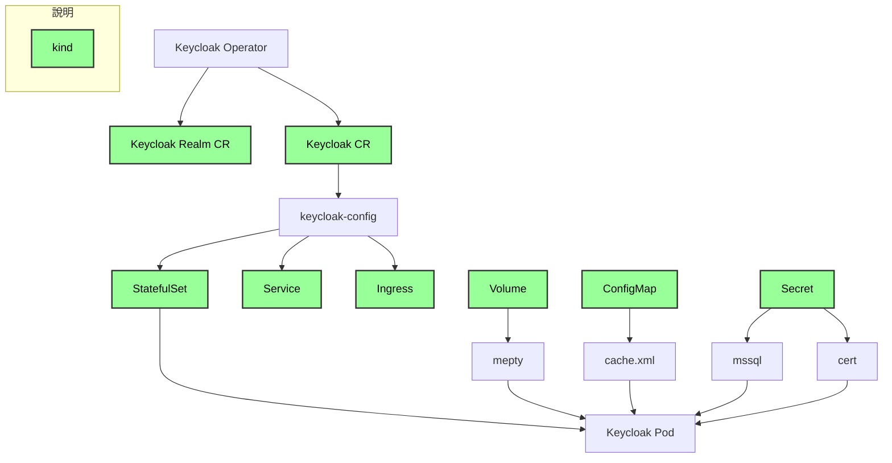

# Keycloak

Keycloak 在 kubernetes 上，是透過 operator 進行控制。



## 安裝 operator

創建命名空間: 

```
$ kubectl create ns keycloak
```


安裝 CRD: 

```
$ kubectl apply -n keycloak -f crd/keycloakrealmimports.k8s.keycloak.org-v1.yml
$ kubectl apply -n keycloak -f crd/keycloaks.k8s.keycloak.org-v1.yml
```


安裝 operator:

```
$ kubectl apply -n keycloak -f operator.yml
```

## 生成 keycloak 實例

創建包含證書的 `secret`: 

```
$ kubectl apply -n keycloak -f cert/mayohr.com-tls.yml
```


創建包含 db 用戶的 `secret`: 

```
$ kubectl apply -n keycloak -f operator.yml
```


創建 `keycloak` 配置檔，以創建 keycloak 實例:

```
$ kubectl apply -n keycloak -f operator.yml
```


創建 `ingressRoute`，以接入流量至 keycloak

```
$ kubectl apply -n keycloak -f ingressRoute.yml
```
